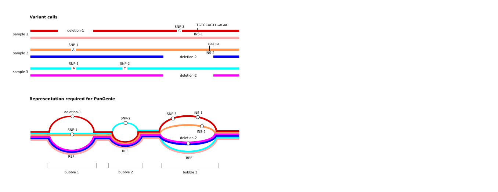

# PanGenie

A short-read genotyper for various types of genetic variants (such as SNPs, indels and structural variants) represented in a pangenome graph. Genotypes are computed based on read k-mer counts and a panel of known, fully assembled haplotypes. A description of the method can be found here: https://doi.org/10.1038/s41588-022-01043-w

## Requirements
* conda or Singularity

## Installation


### Building from source using Singularity (recommended)

Use the Singularity definition file located in ``container/`` to build an (Ubuntu-based) container as follows (requires root privileges):

``[sudo] singularity build pangenie.sif pangenie.def``

In all usage examples below, call the ``PanGenie`` executables as follows:


``` bat
singularity exec pangenie.sif PanGenie-index <PARAMETERS>  
singularity exec pangenie.sif PanGenie <PARAMETERS>
```

For example, to show ``PanGenie``'s command line help, use the following command:

``singularity exec pangenie.sif PanGenie --help``

You can check which versions of ``PanGenie`` (git hash) and of the ``jellyfish`` library have been installed in the container by running the following commands:

``singularity exec pangenie.sif cat /metadata/jellyfish.lib.version``

should produce a line like this (so, here, v2.3.0):

``$ libjellyfish-2.0-2:amd64 2.3.0-4build1 libjellyfish-2.0-dev:amd64 2.3.0-4build1``

``singularity exec pangenie.sif cat /metadata/pangenie.git.version``

should produce a line like this:

``$ 5a1f9c5``


### Building from source using Conda

``` bat
git clone https://github.com/eblerjana/pangenie.git  
cd pangenie  
conda env create -f environment.yml  
conda activate pangenie   
mkdir build; cd build; cmake .. ; make

```


### Building from source (requires jellyfish to be installed)

``` bat
git clone https://github.com/eblerjana/pangenie.git  
cd pangenie  
mkdir build; cd build; cmake .. ; make
```


## Required Input files

PanGenie is a pangenome-based genotyper using short-read data. It computes genotypes for variants represented as bubbles in a pangenome graph by taking information of already known haplotypes (represented as paths through the graph) into account. It can only genotype diploid individuals. The required input files are described in detail below.

### Input variants

PanGenie expects a directed and acyclic pangenome graph as input (``-v`` option).
This graph is represented in terms of a VCF file that needs to have certain properties:

- **multi-sample** - it needs to contain haplotype information of at least one known sample
- **fully-phased** - haplotype information of the known panel samples are represented by phased genotypes and each sample must be phased in **one single block** (i.e. from start to end).
- **non-overlapping variants** - the VCF represents a pangenome graph. Therefore, overlapping variation must be represented in a single, multi-allelic variant record.
- **sequence-resolved** - the REF and ALT sequences need to be given explicitly (i.e. symbolic records are not allowed)

Note especially the third property listed above. See the figure below for an illustration of how overlapping variant alleles need to be represented in the input VCF provided to PanGenie.



We typically generate such VCFs from haplotype-resolved assemblies using this pipeline: https://bitbucket.org/jana_ebler/vcf-merging (also see [Wiki](https://github.com/eblerjana/pangenie/wiki) for different ways to generate VCFs). However, any VCF with the properties listed above can be used as input. Note again that the haplotypes must be phased into a single phased block. So phased VCFs generated by phasing tools like WhatsHap are not suitable!

#### What should I do if my input VCF contains overlapping variants?

* In case your input VCF was produced from a pangenome graph using ``vg decompose``, or by the [Minigraph-Cactus](https://github.com/ComparativeGenomicsToolkit/cactus) or [pggb](https://github.com/pangenome/pggb) pipelines, you first need to filter your VCF with [vcfbub](https://github.com/pangenome/vcfbub) to remove LV > 0 records using this command:

  ``` bat
  vcfbub -l 0 -r 100000 --input <your-vcf-file> > pangenie-ready.vcf
  ```

  For ``Minigraph-Cactus`` VCFs, we also have a more sophisticated filtering pipeline (see https://github.com/eblerjana/genotyping-pipelines/tree/main/prepare-vcf-MC) that can be used alternatively. It not only runs ``vcfbub``, but additionally adds annotations to the alleles encoding variants nested inside of graph bubbles, which can be helpful for downstream analyses of the genotypes. Note that currently, this MC-specific pipeline can only be applied to human data.


* For other callset VCFs (e.g. produced by callers like [PAV](https://github.com/EichlerLab/pav)) you can run PanGenie using the Snakemake pipeline provided in ``pipelines/run-from-callset/``. This automatically merges overlapping alleles into mult-allelic VCF, runs PanGenie and later converts the output VCF back to the original representation.
Note that running this pipeline is not necessary if you are using the input VCFs provided below in Section "Data and genotypes". These VCFs can directly be given as input to PanGenie.


### Input reads

PanGenie is k-mer based and thus expects **short reads** as input. Reads must be provided in a single FASTA or FASTQ file using the ``-i`` option.

### Input reference

PanGenie also needs a reference genome in FASTA format which can be provided using option ``-r``.

## Usage

There are two ways of running PanGenie. The first way (recommended) is to first run a preprocessing step with `` PanGenie-index `` and then `` PanGenie `` with option ``-f``:

``` bat
PanGenie-index -v <variants.vcf> -r <reference.fa> -t <number of threads> -o <outfile-prefix>`
PanGenie -f <outfile-prefix>` -i <reads.fa/fq>  -s <sample-name> -j <nr threads kmer-counting> -t <nr threads genotyping>
```
The second way is to skip the preprocessing step and just run `` PanGenie `` with options ``-v`` and ``-r``, which will produce in the same genotyping results, but uses more memory: 


``` bat
PanGenie -i <reads.fa/fq> -r <reference.fa> -v <variants.vcf> -s <sample-name> -j <nr threads kmer-counting> -t <nr threads genotyping>
```

Both ways will produce the same end results, but running PanGenie in two separate steps is especially useful in cases where one wants to genotype the same set of variants across multiple samples. In such a case, `` PanGenie-index `` allows to do all preprocessing of the variant data only once instead of doing it over and over again for each sample. So when genotyping multiple samples, one needs to run `` PanGenie-index `` only a single time, and then runs `` PanGenie `` separately on each sample re-using the precomputed data. This reduces memory usage and runtime. 

Below, details on these commands are provided.

### Preprocessing step (optional, but recommended)

During preprocessing, steps **unrelated to the genotyped sample(s)** are performed, like processing the input variants and determining unique k-mers in the graph. In a setting in which the same set of input variants are genotyped across multiple samples, the advantage is that this preprocessing step **needs to be run only once**. The preprocessing step can be run using the command `` PanGenie-index ``:

``` bat
PanGenie-index -v <variants.vcf> -r <reference.fa> -t <number of threads> -o <outfile-prefix>``
```

The full list of options is previded below:

``` bat
program: PanGenie - genotyping based on kmer-counting and known haplotype sequences.
author: Jana Ebler

version: v3.0.0
usage: 
PanGenie-index [options] -r <reference.fa> -v <variants.vcf> -o <index-prefix>

options:
	-e VAL	size of hash used by jellyfish (default: 3000000000).
	-k VAL	kmer size (default: 31).
	-o VAL	prefix of the output files. NOTE: the given path must not include non-existent folders.
	-r VAL	reference genome in FASTA format. NOTE: INPUT FASTA FILE MUST NOT BE COMPRESSED.
	-t VAL	number of threads to use for kmer-counting (default: 1).
	-v VAL	variants in VCF format. NOTE: INPUT VCF FILE MUST NOT BE COMPRESSED.


```

The pre-proccessing step will result in a set of files (listed below) that can be used by `` PanGenie `` in order to genotype a specific sample:

* `` <outfile-prefix>_<chromosome>_Graph.cereal `` (one for each chromosome) serialization of Graph object
* `` <outfile-prefix>_<chromosome>_kmers.tsv.gz `` (one for each chromosome) containing unique k-mers
* `` <outfile-prefix>_UniqueKmersMap.cereal `` serialization of UniqueKmersMap object
* `` <outfile-prefix>_path_segments.fasta `` containing all reference and allele sequences of the graph

You don't need to understand what any of these files represent. They mainly contain information important to the subsequent genotyping step and `` PanGenie `` automatically processes them while running. So the only important thing is to not delete them prior to running `` PanGenie ``.


### Genotyping step

After preprocessing is completed, the genotyping step can be run in order to genotype a specific sample. If multiple samples shall be genotyped, this step needs to be run on each of these samples separately (while the preprocessing needs to be done only once). Based on the sequencing reads of a sample and the pre-computed files, genotyping is run using the command `` PanGenie `` with option ``-f``:

``` bat
PanGenie -f <outfile-prefix> -i <reads.fa/fq> -s <sample-name> -j <nr threads kmer-counting> -t <nr threads genotyping>``
```

The full list of options is provided below:

``` bat
program: PanGenie - genotyping based on kmer-counting and known haplotype sequences.
author: Jana Ebler

version: v3.0.0
usage: 
PanGenie [options] -f <index-prefix> -i <reads.fa/fq> -o <outfile-prefix>
PanGenie [options] -i <reads.fa/fq> -r <reference.fa> -v <variants.vcf> -o <outfile-prefix>

options:
	-a VAL	sample subsets of paths of this size (default: 0).
	-c	count all read kmers instead of only those located in graph
	-e VAL	size of hash used by jellyfish (default: 3000000000).
	-f VAL	Filename prefix of files computed by PanGenie-index (i.e. option -o used with PanGenie-index).
	-g	run genotyping (Forward backward algorithm, default behaviour)
	-i VAL	sequencing reads in FASTA/FASTQ format or Jellyfish database in jf format. NOTE: INPUT FASTA/Q FILE MUST NOT BE COMPRESSED.
	-j VAL	number of threads to use for kmer-counting (default: 1).
	-k VAL	kmer size (default: 31).
	-o VAL	prefix of the output files. NOTE: the given path must not include non-existent folders (default: result).
	-p	run phasing (Viterbi algorithm). Experimental feature
	-r VAL	reference genome in FASTA format. NOTE: INPUT FASTA FILE MUST NOT BE COMPRESSED.
	-s VAL	name of the sample (will be used in the output VCFs) (default: sample).
	-t VAL	number of threads to use for core algorithm. Largest number of threads possible is the number of chromosomes given in the VCF (default: 1).
	-u	output genotype ./. for variants not covered by any unique kmers
	-v VAL	variants in VCF format. NOTE: INPUT VCF FILE MUST NOT BE COMPRESSED.


```

The result will be a VCF file containing genotypes of the sample for the variants provided in the input VCF. Per default, the name of the output VCF is `` result_genotyping.vcf ``. You can specify the prefix of the output file using option ``-o <prefix>``, i.e. the output file will be named as ``<prefix>_genotyping.vcf ``.
The full list of options is provided below.

If you want to genotype the same set of variants across more than one sample, run the command above separately on each sample. The preprocessing step only needs to be run once (as long as the VCF does not change).


### Running PanGenie with a single command

We also provide the option of running  `` PanGenie `` without running the preprocessing step first. This can be done by running it with parameters `` -v `` and `` -r `` instead of ``-f ``. This will automatically do the preprocessing steps. In contrast to ``PanGenie-index``, it does not write as many files to disk during preprocessing to save time, but needs more RAM (similar to previous release v2.1.1). Running PanGenie like this might be useful in cases where one wants to genotype a single sample only, or to save some disk space.

As mentioned before, especially when genotyping more than one sample, it is beneficial to run both steps separately, since the preprocessing needs to be run only once for all samples, while the genotyping step needs to be run separately on each sample. Running PanGenie with a single command works as follows:

``` bat
PanGenie -i <reads.fa/fq> -r <reference.fa> -v <variants.vcf> -s <sample-name> -j <nr threads kmer-counting> -t <nr threads genotyping> ``
```


## Remarks

* PanGenie is designed for whole genome genotyping, i.e. using the full set of variants as input rather than restricting to certain regions and/or variant types. In case you want to genotype a certain genomic region only (which is not the ideal use case for PanGenie), make sure the provided reference genome as well as the provided reads only contain data for these respective regions.


* PanGenie is a re-genotyping tool, **not a variant caller**. It re-genotypes the variants provided in the input VCF, meaning the output VCF will contain the same variant records as the input, just with genotypes added for the sample PanGenie is run on. It cannot detect new variant alleles.


## Runtime and memory usage

Runtime and memory usage depend on the number of variants genotyped and the number of haplotypes present in the graph. PanGenie is fastest when it is installed using Singularity (see above).

The largest dataset that we have tested (HPRC: https://doi.org/10.1101/2022.07.09.499321) contained around 27 million variants, 88 haplotypes and around 30x read coverage. With 24 cores, `` PanGenie-index `` ran in 34 minutes (around 3 CPU hours) using 60 GB of RAM. `` PanGenie `` with option ``-f`` ran in 1 hour and 40 minutes using 24 cores (around 14 CPU hours) and used 37 GB of RAM.
Running PanGenie without preprocessing, ``PanGenie`` needs 2 hours and 35 minutes using 24 cores (around 18 CPU hours) and 84 GB of RAM.


## Limitations

* The runtime of PanGenie gets slow as the number of haplotype paths increases. Due to technical reasons, the current implementation of PanGenie cannot handle more than 254 input haplotypes (127 diploid samples).
* PanGenie can only genotype diploid genomes. It cannot be used for polyploid samples.

## Demo

The typical use case is to run PanGenie on a whole genome dataset. The following example is just a little demo illustrating how to run PanGenie. 

We run PanGenie given a pangenome graph (VCF file,``test-variants.vcf``), sequencing reads (FASTA/FASTQ file, ``test-reads.fa``) and a reference sequence (FASTA file, ``test-reference.fa``) provided in the ``demo/`` folder. After installation, PanGenie's genotyping algorithm can be run using the following commands (which will take a few seconds for this example):

``` bat
PanGenie-index -r test-reference.fa -v test-variants.vcf -o preprocessing -e 100000
PanGenie -f preprocessing -i test-reads.fa -o test -e 100000
```

The result will be a VCF file named `` test_genotyping.vcf `` containing the same variants as the input VCF with additional genotype predictions, genotype likelihoods and genotype qualities.

Parameter `` -e `` sets the hash size used by Jellyfish for k-mer counting. When running PanGenie on a whole genome dataset, this parameter can be omitted (so that PanGenie uses the default value).

Per default, PanGenie uses a single thread. The number of threads used for k-mer counting and genotyping/phasing can be set via parameters ``-j`` and ``-t``, respectively. 


## Data and genotypes


We have already produced input reference panels for several datasets from high-quality, haplotype-resolved assemblies that can be used as input to PanGenie. These files were used to produce genotyping results for the HGSVC and HPRC projects. Genotypes for 3,202 samples from the 1000 Genomes Project produced based on these VCFs are also linked below.

**Note**: results produced by different versions of PanGenie are not directly comparable, since newer versions of PanGenie produce more accurate genotyping results.

### PanGenie v1.0.0

| Dataset | PanGenie input VCF        |  Callset VCF         | 1000G Genotypes (n=3,202)  |
|-------------| :-------------: |:-------------:| -----:|
| HGSVC-GRCh38 (freeze3, 64 haplotypes) | [graph-VCF](https://zenodo.org/record/7763717/files/pav-panel-freeze3.vcf.gz?download=1) | [callset-VCF](https://zenodo.org/record/7763717/files/pav-calls-freeze3.vcf.gz?download=1) | [1000G-VCF](http://ftp.1000genomes.ebi.ac.uk/vol1/ftp/data_collections/HGSVC2/release/v1.0/PanGenie_results/pangenie_merged_bi_all.vcf.gz) (PanGenie v1.0.0)
| HGSVC-GRCh38 (freeze4, 64 haplotypes) |  [graph-VCF](https://zenodo.org/record/7763717/files/pav-panel-freeze4.vcf.gz?download=1)     | [callset-VCF](https://zenodo.org/record/7763717/files/pav-calls-freeze4.vcf.gz?download=1) | [1000G-VCF](http://ftp.1000genomes.ebi.ac.uk/vol1/ftp/data_collections/HGSVC2/release/v2.0/PanGenie_results/20201217_pangenie_merged_bi_all.vcf.gz) (PanGenie v1.0.0) |
| HPRC-GRCh38 (88 haplotypes) | [graph-VCF](https://zenodo.org/record/6797328/files/cactus_filtered_ids.vcf.gz?download=1)     |  [callset-VCF](https://zenodo.org/record/6797328/files/cactus_filtered_ids_biallelic.vcf.gz?download=1)    | [1000G-VCF](https://zenodo.org/record/6797328/files/all-samples_bi_all.vcf.gz?download=1)  (PanGenie v1.0.0)  |

### PanGenie v2.1.1

| Dataset | PanGenie input VCF        |  Callset VCF         | 1000G Genotypes (n=3,202)  |
|-------------| :-------------: |:-------------:| -----:|
| HPRC-CHM13 (88 haplotypes) | [graph-VCF](https://zenodo.org/record/7839719/files/chm13_cactus_filtered_ids.vcf.gz?download=1) | [callset-VCF](https://zenodo.org/record/7839719/files/chm13_cactus_filtered_ids_biallelic.vcf.gz?download=1)   |  [1000G-VCF](https://zenodo.org/record/7839719/files/chm13_all-samples_bi_all.vcf.gz?download=1) (PanGenie v2.1.1) |


In all cases, the graph-VCFs provided in the second column were given as input to PanGenie. The callset-VCFs (third column) were used to convert the genotyped VCFs into a biallelic, callset representation using the following command:

``  cat <pangenie-output> | python3 convert-to-biallelic.py <callset-VCF>  > callset-genotypes.vcf ``

The script `` convert-to-biallelic.py `` can be found here: https://github.com/eblerjana/pangenie/blob/master/pipelines/run-from-callset/scripts/convert-to-biallelic.py. Also see our [Wiki](https://github.com/eblerjana/pangenie/wiki) for more details on how to use PanGenie with these data sets.


## Citation

J. Ebler, P. Ebert, W. E. Clarke, T. Rausch, P. A. Audano, T. Houwaart, Y. Mao, J. Korbel, E. E. Eichler,
M. C. Zody, A. T. Dilthey, and T. Marschall. Pangenome-based genome inference. *Nature Genetics*,
54(4):518–525, 2022.
