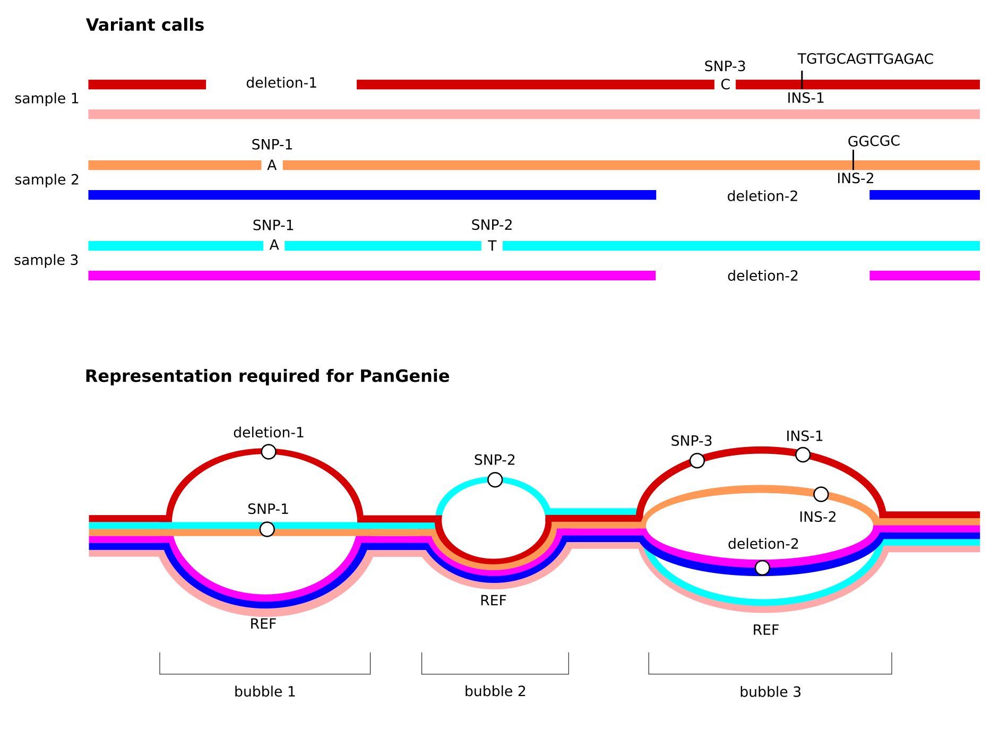

=====================
Input files
=====================

PanGenie is a pangenome-based genotyper using short-read data. It computes genotypes for variants represented as bubbles in a pangenome graph by taking information of already known haplotypes (represented as paths through the graph) into account. It can only genotype diploid individuals. The required input files are described in detail below.

----------------
Input variants
----------------

PanGenie expects a directed and acyclic pangenome graph as input (``-v`` option).
This graph is represented in terms of a VCF file that needs to have certain properties:

- **multi-sample** - it needs to contain haplotype information of at least one known sample
- **fully-phased** - haplotype information of the known panel samples are represented by phased genotypes and each sample must be phased in **one single block** (i.e. from start to end).
- **non-overlapping variants** - the VCF represents a pangenome graph. Therefore, overlapping variation must be represented in a single, multi-allelic variant record.
- **sequence-resolved** - the REF and ALT sequences need to be given explicitly (i.e. symbolic records are not allowed)

Note especially the third property listed above. See the figure below for an illustration of how overlapping variant alleles need to be represented in the input VCF provided to PanGenie.
We provide details on how to generate such VCFs below.

------------
Input reads
------------

PanGenie is k-mer based and thus expects **short reads** as input. Reads must be provided in a single FASTA or FASTQ file using the ``-i`` option.

-----------------
Input reference
-----------------

PanGenie also needs a reference genome in FASTA format which can be provided using option ``-r``.

===============================
How to generate input VCFs
===============================

We provide PanGenie-ready VCFs for multiple datasets in `Data and genotypes <https://pangenie.readthedocs.io/en/latest/data.html>`_. These VCFs can directly be given as input to PanGenie. If you want to generate a PanGenie-ready VCF from your own data, you can follow the instructions below.

-----------------------------------------------------
Creating a PanGenie input VCF from a pangenome graph
-----------------------------------------------------

* In case your input VCF was produced from a pangenome graph using ``vg deconstruct``, you first need to filter your VCF with `vcfbub <https://github.com/pangenome/vcfbub>`_ to remove LV > 0 records using the command below. This will only keep top-level bubbles of the graph, which can then be genotyped with PanGenie::

   vcfbub -l 0 -r 100000 --input <your-vcf-file> > pangenie-ready.vcf

* VCFs produced by the `Minigraph-Cactus pipeline <https://github.com/ComparativeGenomicsToolkit/cactus>`_ (with parameter ``--vcf``) are already filtered with ``vcfbub`` and thus do not contain any overlapping variants (no need to run vcfbub again). Such VCFs can directly be used with PanGenie to genotype bubbles. However, we recommend running our `preprocessing pipeline <https://github.com/eblerjana/pangenie/tree/master/pipelines/prepare-vcf-from-MC>`_ on the MC output VCF prior to running PanGenie, which adds annotations to the alleles in the VCF encoding variants nested inside of graph bubbles. These annotations are not necessary for PanGenie but are very useful for downstream analyses of the bubble genotypes as they allow to convert bubble genotypes to genotypes for all nested variants. Note that currently, this MC-specific pipeline can only be applied to human data. Also, this pipeline does not work for already decomposed VCFs (such as the ones produced by MC using ``--vcfwave``)!

-----------------------------------------------------------------
Creating a PanGenie input VCF from haplotype-resolved assemblies
-----------------------------------------------------------------

PanGenie input VCFs can be generated from haplotype-resolved assemblies using `this pipeline <https://github.com/eblerjana/pangenie/tree/master/pipelines/prepare-vcf-from-assemblies>`_ (also see XXX).

---------------------------------------------------------
Creating a PanGenie input VCF from a phased callset
---------------------------------------------------------

Any VCF with the properties listed above can be used as input to PanGenie. However, note that haplotypes must be phased in a single block. Phased VCFs generated with phasing tools like WhatsHap are not suitable.

For callset VCFs (e.g. produced by callers like `PAV <https://github.com/EichlerLab/pav>`_) which contain overlapping variant records, you can run PanGenie using this `Snakemake pipeline <https://github.com/eblerjana/pangenie/tree/master/pipelines/run-from-callset>`_. This automatically merges overlapping alleles into mult-allelic VCF, runs PanGenie and later converts the output VCF back to the original representation.

