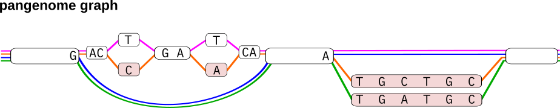
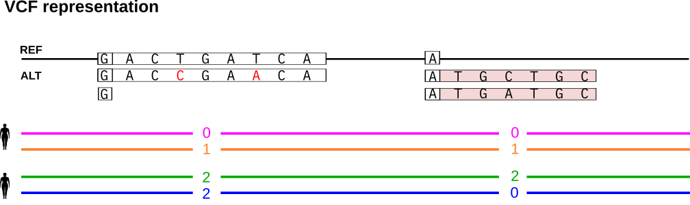
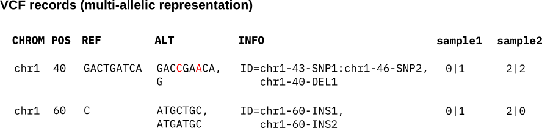
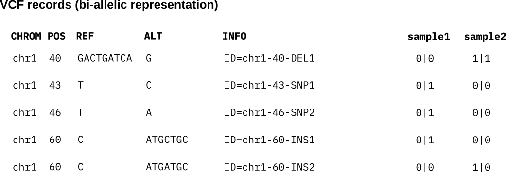
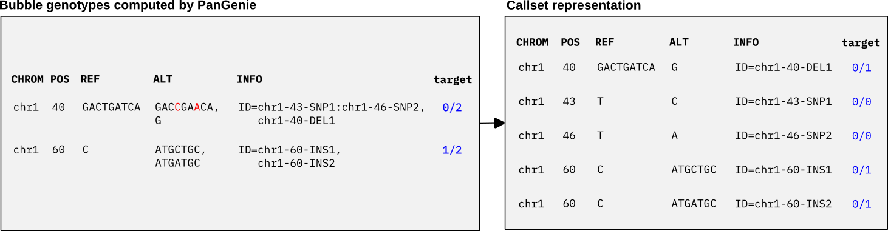

----------------------------------------------------
Representing nested variation
----------------------------------------------------

Pangenome graph construction tools like the Minigraph-Cactus pipeline build pangenomes from haplotype-resolved de novo assemblies. Variation between haplotypes is represented in terms of bubble structures in the graph. Each haplotype is additionally stored as a path through the graph. In the example shown below, the graph represents four haplotypes (shown in pink, orange, green and blue) and two top-level bubble structures.
Bubbles in the graph can get very large, especially in highly variable regions where many variant alleles overlap across haplotypes. Thus, they often do not represent a single variant event but are rather a combination of many invididual variants overlapping across the haplotypes in the corresponding genomic regions. In other words, bubbles often contain nested variant alleles. A simple example is the first bubble of the graph shown below, which contains two nested SNPs overlapping a larger deletion allele. Being able to decompose genotypes of such big bubbles into genotypes of their nested variants is thus useful for many downstream applications, especially if they involve comparisons to other variant callsets. Here, we describe how our pipelines producing PanGenie input VCFs typically encode nested variation in bubbles.

In VCF representation, each top-level bubble is encoded as a separate record. Each path through the bubble covered by at least one haplotype is listed as an alternative allele. The reference allele refers to the sequence of the path that the reference genome follows through the graph and the position of the variant is also derived relative to the reference genome. The haplotypes are encoded in terms of phased genotypes in the sample columns of the VCF.

We show how to represent the bubbles in VCF format. The first bubble contains two nested SNP variants. Our pipelines typically produce PanGenie input VCFs assigning a unique ID to each (nested) variant allele and encode such nested alleles in the INFO/ID field of the VCF. This field has one entry for each ALT sequence in the VCF. If an ALT sequence traverses nested alleles (such as the sequence covered by the orange haplotype), the respective field lists the corresponding IDs, separated by a colon. 
If there are no nested alleles, the ID field just contains a single ID. See the Figure below for an example. The first bubble record consists of two alternative alleles. The first ALT allele corresponds to the path of the orange haplotype and thus traverses the two nested SNP variants. Therefore, its INFO/ID field lists the IDs of these two SNPs, separated by a colon. The second alternative allele refers to the deletion (the path taken by the blue and green haplotypes) and does not contain any further nested alleles. Therefore, the INFO/ID column just consists of a single ID, corresponding to the deletion itself.
We refer to this annotated VCF as the **bubble VCF** in the following.

Instead of representing each bubble as a record in the VCF, an alternative is to convert the VCF into a bi-allelic representation which lists a separate record for each individual (nested) allele, i.e. one record per unique ID. See below for the bi-allelic representation of the above VCF records. Each individual ID is listed as a separate record with its corresponding REF and ALT sequences. The bubble genotypes are translated into bi-allelic genotypes encoding the presence (1) and absence (0) of each individual variant ID in the haplotypes. We refer to this bi-allelic VCF as the **callset VCF** in the following.

We can genotype bubbles in the pangenome graph with PanGenie using the annotated, multi-allelic *bubble VCF* as input. After genotyping, we can postprocess the VCF to convert bubble genotypes to genotypes for each individual variant allele represented in the *callset VCF*. We show an example below. With our given *bubble VCF*, PanGenie will compute a genotype for the target sample for each bubble record and output the results as a VCF (left panel of the Figure below). Based on our annotations, we can now easily translate the bubble genotypes into our *callset* representation, by checking absence and presence of each ID in the bubble genotypes (right panel of the Figure below).

**Note:** these annotations are useful in many cases, but PanGenie can still be run on VCFs not containing them. In fact, the annotations are not used by PanGenie. They just enable an additional postprocessing step which helps analyzing variation encoded inside of bubbles and we will show how to do this below.

Converting bubble genotypes to variant genotypes
=================================================

For input VCFs containing annotations as described above, PanGenie is run using the same commands as before::

  PanGenie-index -v <bubbles.vcf> -r <reference.fa> -t <number of threads> -o <outfile-prefix>
  PanGenie -f <outfile-prefix> -i <reads.fa/fq>  -s <sample-name> -j <nr threads kmer-counting> -t <nr threads genotyping> -o <outfile-prefix>

However, we can add an additional step for each genotyped sample after genotyping which converts the genotypes PanGenie computes for all bubbles in the graph to genotypes of all nested variant alleles represented in the bubbles. Note that this step only works if the VCF has these specific annotations explained above.

Postprocessing can be run as::

    cat <outfile-prefix>_genotyping.vcf | python3 convert-to-biallelic.py <callset.vcf> > pangenie_genotyping_biallelic.vcf

The script ``convert-to-biallelic.py`` is provided `here <https://github.com/eblerjana/pangenie/blob/master/pipelines/run-from-callset/scripts/convert-to-biallelic.py>`_.

The result is a bi-allelic VCF containing a separate record for each individual variant ID contained in the *callset VCF*, with a genotype assigned. These genotypes are derived from the genotypes PanGenie computed for the respective bubble in the graph.
