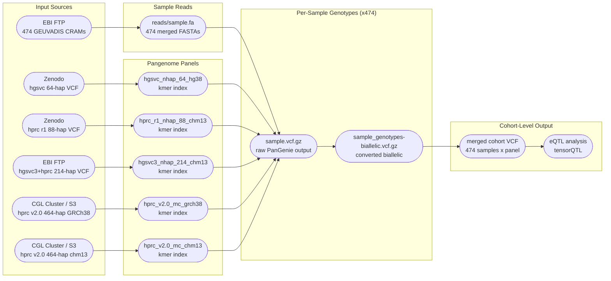
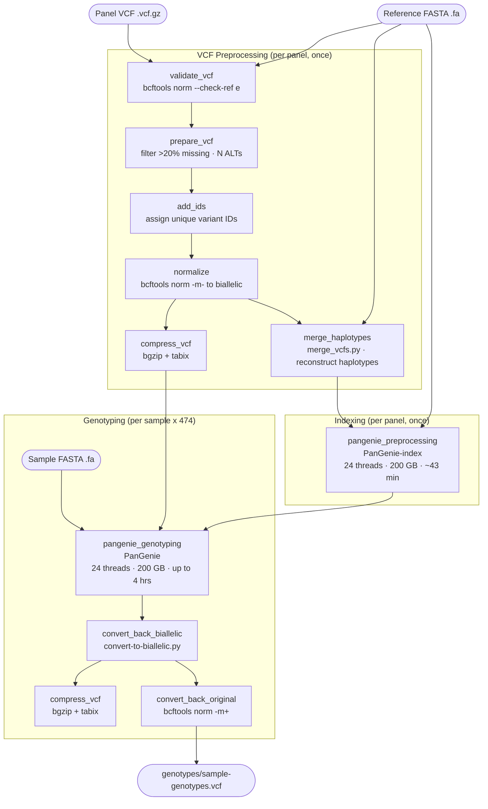

# PanGenie Vignettes
**Author:** Andrew Blair

This directory contains vignettes and tutorials for running PanGenie on paired WGS cohorts using a Snakemake-based pipeline on an HPC cluster (SLURM).

---

## Benchmarking Goals

We are genotyping **474 GEUVADIS samples** across **5 pangenome reference panels** to evaluate:

- **Panel size effect**: how haplotype diversity (64, 88, 214, 464 haplotypes) impacts genotyping quality
- **Reference genome effect**: GRCh38 vs chm13v2.0 (masked and unmasked) as the coordinate system
- **eQTL discovery power**: whether pangenome-derived genotypes improve eQTL detection over standard linear reference calls
- **Cross-panel concordance**: genotype agreement across panels for the same samples

| Panel | Reference | Haplotypes | Status |
|---|---|---|---|
| hgsvc_nhap_64_hg38 | GRCh38 | 64 | Genotyping complete (471/474); biallelic conversion in progress |
| hprc_r1_nhap_88_chm13 | chm13v2.0 (masked) | 88 | Index built; genotyping pending |
| hgsvc3_hprc_r1_nhap_214_chm13 | chm13v2.0 (unmasked) | 214 | Index built; genotyping pending |
| hprc_v2.0_mc_chm13 | chm13v2.0 (masked) | 464 | Genotyping complete (474/474); biallelic conversion pending |
| hprc_v2.0_mc_grch38 | GRCh38 | 464 | Genotyping complete (474/474); biallelic conversion in progress |

**Last updated:** March 2, 2026

> 3 samples (NA19117, NA12272, HG02018) missed during initial download are being reprocessed through a targeted job covering CRAM download, genotyping, and biallelic conversion for the hgsvc_nhap_64_hg38 panel.

---

## Data Model



---

## Pipeline Overview



### Results Directory Structure

```
results/
└── <panel>/
    ├── input-vcf/
    │   ├── validate-vcf.log                 sentinel: bcftools REF check
    │   ├── input-missing-removed.vcf        filtered variants
    │   ├── callset.vcf.gz                   unique IDs assigned
    │   ├── callset-biallelic.vcf            normalized biallelic
    │   ├── callset-biallelic.vcf.gz         compressed
    │   └── callset-biallelic.vcf.gz.tbi     tabix index
    ├── pangenome/
    │   └── pangenome.vcf                    haplotype-merged VCF (PanGenie input)
    ├── pangenie/
    │   ├── indexing/                        kmer index (shared across all samples)
    │   │   └── index.*
    │   ├── <sample>_graph_genotyping.vcf
    │   ├── <sample>_genotypes-biallelic.vcf
    │   └── <sample>_genotypes-biallelic.vcf.gz
    ├── genotypes/
    │   └── <sample>-genotypes.vcf           final output: multiallelic, original coords
    └── benchmarks/
        └── *.txt                            Snakemake runtime + memory per rule
```

---

## GEUVADIS GRCh38 Analysis

A step-by-step guide for genotyping GEUVADIS samples using PanGenie v4.2.1 with the GRCh38 reference genome and the HPRC v2.0 pangenome panel.

### Prerequisites

- Singularity (PanGenie container)
- Snakemake 7.28.3
- SLURM cluster
- bcftools, bgzip, tabix, samtools, aria2c in PATH
- conda base environment with pyfaidx

---

### Step 1: Reference Genome

```bash
wget -O GRCh38_full_analysis_set_plus_decoy_hla.fa \
  http://ftp.1000genomes.ebi.ac.uk/vol1/ftp/technical/reference/GRCh38_reference_genome/GRCh38_full_analysis_set_plus_decoy_hla.fa
```

---

### Step 2: Pangenome VCF

Download the input VCF for each panel. All files should be placed in `vcf/`.

#### hgsvc_nhap_64_hg38 (64 haplotypes, GRCh38)
Source: Zenodo ([Ebert et al. 2021](https://zenodo.org/record/7763717))
```bash
wget -O vcf/hgsvc_nhap_64_hg38.vcf.gz \
  "https://zenodo.org/record/7763717/files/pav-panel-freeze4.vcf.gz?download=1"
```

This VCF is missing `##contig` header lines required by bcftools. Add them using the reference `.fai`:
```bash
bcftools reheader \
  --fai reference/GRCh38_full_analysis_set_plus_decoy_hla.fa.fai \
  vcf/hgsvc_nhap_64_hg38.vcf.gz \
  -o vcf/hgsvc_nhap_64_hg38.reheadered.vcf.gz
tabix -p vcf vcf/hgsvc_nhap_64_hg38.reheadered.vcf.gz
```

**Note:** `bcftools reheader --fai` only adds `##contig` metadata lines to the header — no variant records are modified.

Update `config_hgsvc_nhap_64_hg38.yaml` to point to the reheadered file:
```yaml
vcf: vcf/hgsvc_nhap_64_hg38.reheadered.vcf.gz
```

#### hprc_r1_nhap_88_chm13 (88 haplotypes, chm13v2.0 masked)
Source: Zenodo
```bash
wget -O vcf/hprc_r1_nhap_88_chm13.vcf.gz \
  "https://zenodo.org/record/7839719/files/chm13_cactus_filtered_ids.vcf.gz?download=1"
```

#### hgsvc3_hprc_r1_nhap_214_chm13 (214 haplotypes, chm13v2.0 unmasked)
Source: HGSVC3 EBI FTP
```bash
wget -O vcf/hgsvc3_hprc_r1_nhap_214_chm13.vcf.gz \
  https://ftp.1000genomes.ebi.ac.uk/vol1/ftp/data_collections/HGSVC3/release/Genotyping_1kGP/PanGenie-genotypes/1.0/MC_hgsvc3-hprc_chm13_filtered_bubbles.vcf.gz
```

**Important:** This panel requires `chm13v2.0.fa` (full unmasked). The masked reference hard-masks PAR2 on chrY (~62.4 Mb) to N's, causing REF allele mismatches in PanGenie.

#### hprc_v2.0_mc_grch38 (464 haplotypes, GRCh38)
Source: HPRC S3 (public) or CGL cluster
```bash
# From S3
aws s3 cp --no-sign-request \
  s3://human-pangenomics/pangenomes/scratch/2025_02_28_minigraph_cactus/hprc-v2.0-mc-grch38/hprc-v2.0-mc-grch38.pgin.vcf.gz \
  vcf/

# From CGL cluster (internal)
cp /private/groups/cgl/hprc-graphs/hprc-v2.0-feb28/hprc-v2.0-mc-grch38/hprc-v2.0-mc-grch38.pgin.vcf.gz vcf/
```

#### hprc_v2.0_mc_chm13 (464 haplotypes, chm13v2.0 masked)
Source: CGL cluster (see [Zenodo 15223961](https://zenodo.org/records/15223961) for public release)
```bash
cp /private/groups/cgl/hprc-graphs/hprc-v2.0-feb28/hprc-v2.0-mc-chm13/hprc-v2.0-mc-chm13.pgin.vcf.gz vcf/
```

The `.pgin.vcf.gz` files for the HPRC v2.0 panels were generated by Glenn Hickey using the [`prepare-vcf-MC`](https://github.com/eblerjana/genotyping-pipelines/tree/a7af349abd8fa4d2181b6698a1cf3161588a375f/prepare-vcf-MC) pipeline and already contain correct headers — no reheadering required.

---

### Step 3: CRAM to FASTA Conversion

Prepare a sample manifest (`igsr-illumina-phase3-geuvadis-samples.csv`):
```
sample_id,cram_url,md5sum
NA12778,ftp://ftp.sra.ebi.ac.uk/vol1/run/ERR323/ERR3239484/NA12778.final.cram,b03ae320c1a3b13c750d23d28a8dbc13
```

Download CRAM with aria2c:
```bash
aria2c \
  -x 8 -s 8 -k 1M \
  --file-allocation=none \
  --continue=true \
  --summary-interval=30 \
  --max-tries=20 \
  --retry-wait=30 \
  --timeout=60 \
  --connect-timeout=30 \
  -o "${SAMPLE_ID}.cram" \
  "${CRAM_URL}"
```

Convert CRAM to merged FASTA (R1 + R2 interleaved, PanGenie input format):
```bash
samtools fastq \
  -@ "${THREADS}" \
  --reference GRCh38_full_analysis_set_plus_decoy_hla.fa \
  -n \
  "${SAMPLE_ID}.cram" \
  | awk 'NR%4==1{printf ">%s\n", substr($0,2)} NR%4==2{print}' \
  > "${SAMPLE_ID}.fa"
```

---

### Step 4: Snakemake Genotyping Pipeline

The pipeline (`pipelines/run-from-callset/`) handles all remaining steps automatically.

**Configure** (`config_<panel>.yaml`):
```yaml
outdir: results/hprc_v2.0_mc_grch38
vcf: vcf/hprc-v2.0-mc-grch38.pgin.vcf.gz
reference: reference/GRCh38_full_analysis_set_plus_decoy_hla.fa
reads:
  NA12778: reads/NA12778.fa
```

**Launch** (from a persistent screen/tmux session on a compute node):
```bash
cd pipelines/run-from-callset
snakemake --configfile config_hprc_v2.0_mc_grch38.yaml --profile slurm --nolock \
  > slurm_logs/snakemake_hprc_v2.0_mc_grch38.out 2>&1
```

**Note:** Snakemake 7 cluster mode exits after each job batch. Simply rerun the same command to continue — `rerun-incomplete: true` ensures it picks up exactly where it left off.

**Pipeline steps:**

| # | Rule | Output | Description |
|---|---|---|---|
| 1 | validate_vcf | `input-vcf/validate-vcf.log` | bcftools REF allele check |
| 2 | prepare_vcf | `input-vcf/input-missing-removed.vcf` | Filter greater than 20% missing genotypes and N ALT alleles |
| 3 | add_ids | `input-vcf/callset.vcf.gz` | Assign unique IDs to all alleles |
| 4 | normalize | `input-vcf/callset-biallelic.vcf` | Split multiallelic to biallelic |
| 5 | compress_vcf | `input-vcf/callset-biallelic.vcf.gz` | bgzip + tabix |
| 6 | merge_haplotypes | `pangenome/pangenome.vcf` | Reconstruct haplotype sequences for PanGenie |
| 7 | pangenie_preprocessing | `pangenie/indexing/` | Build kmer index (PanGenie-index, 24 threads, 200GB) |
| 8 | pangenie_genotyping | `pangenie/<sample>_graph_genotyping.vcf` | Genotype sample (PanGenie, 24 threads, 200GB) |
| 9 | convert_back_biallelic | `pangenie/<sample>_genotypes-biallelic.vcf` | Map back to biallelic representation |
| 10 | compress_vcf | `pangenie/<sample>_genotypes-biallelic.vcf.gz` | bgzip + tabix |
| 11 | convert_back_original | `genotypes/<sample>-genotypes.vcf` | Merge biallelic back to multiallelic (bcftools norm -m+) |

**Monitor:**
```bash
tail -f slurm_logs/snakemake_hprc_v2.0_mc_grch38.out
squeue -u $USER
```

**Final output:** `results/hprc_v2.0_mc_grch38/genotypes/<sample>-genotypes.vcf`

---

## Contributing

Additional vignettes and improvements are welcome.
